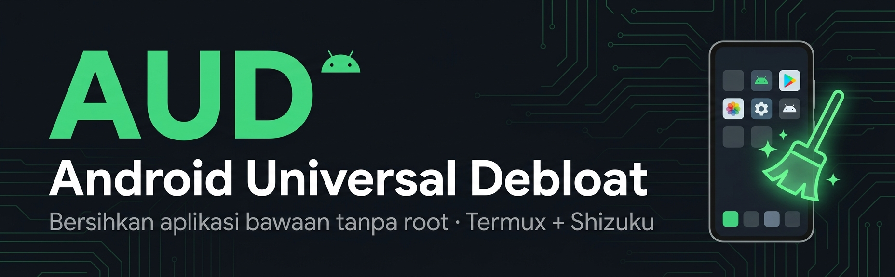

<div align="center">



# Android Universal Debloat (AUD)

**Bersihkan aplikasi bawaan (bloatware) HP Android — TANPA ROOT.**
CLI sederhana berbahasa Indonesia, jalan di **Termux + Shizuku (rish)**.

[-3DDC84?logo=android&logoColor=white)](#)
[](#)
[](#)
[](LICENSE)

🌐 **Website:** [www.myrul.dev](https://www.myrul.dev) · 📘 **Facebook:** [/myruldev](https://web.facebook.com/myruldev)

</div>

---

## 📌 Apa ini?

**Android Universal Debloat (AUD)** adalah alat untuk **menonaktifkan aplikasi bawaan**
yang tidak kamu butuhkan (bloatware) supaya HP lebih ringan, hemat baterai, dan lebih privat —
**tanpa perlu root** dan **tanpa menghapus paksa**.

Aplikasi hanya **dinonaktifkan** (disable) memakai perintah resmi Android:
```
pm disable-user --user 0 nama.paket
```
dan bisa **dipulihkan** kapan saja:
```
pm enable nama.paket
```

> ⚠️ **Aman & bisa dibatalkan.** Aplikasi tidak benar-benar dihapus, jadi kalau ada yang keliru,
> tinggal pulihkan lewat menu **Pulihkan Aplikasi**.

---

## ✨ Fitur

- ✅ **Tanpa root** — pakai Shizuku (`rish`).
- 🧠 **Deteksi merek otomatis** lewat `getprop`, lalu memuat database yang sesuai.
- 🗂️ **25 database merek** (universal + 24 merek) — total 470+ paket terkurasi.
- 🟢 **Debloat Aman** (risiko `safe`) & 🟡 **Debloat Disarankan** (`safe` + `recommended`).
- ✋ **Pilih Sendiri (Manual)** — kendali penuh, pilih satu per satu.
- 🔎 **Cari Aplikasi** lewat kata kunci.
- 📊 **Cek Status Debloat** — lihat mana yang sudah nonaktif / masih aktif.
- 🧩 **Deteksi Aplikasi Tak Dikenal** — temukan bloatware baru, otomatis disimpan untuk dilaporkan.
- 🧪 **Mode Simulasi (Dry-Run)** — coba tanpa mengubah apa pun.
- 🛡️ **Whitelist pelindung** paket penting + **whitelist kustom** (`database/whitelist.txt`).
- 💾 **Backup otomatis** sebelum setiap aksi & 📝 **log lengkap** semua aktivitas.
- 🇮🇩 **Antarmuka bahasa Indonesia**, ramah pengguna awam, selalu minta konfirmasi `(y/n)`.

---

## 📋 Yang Dibutuhkan

| Kebutuhan | Keterangan |
|---|---|
| **Termux** | Disarankan versi dari [F-Droid](https://f-droid.org/packages/com.termux/) (bukan Play Store). |
| **Shizuku** | Aplikasi [Shizuku](https://shizuku.rikka.app/) yang sudah diaktifkan. |
| **rish** | Perintah `rish` dari Shizuku, dapat dipanggil di Termux. |
| **Android 7+** | Disarankan Android 8 ke atas. |

---

## 🚀 Instalasi & Cara Pakai

### 1) Pasang Termux & Shizuku
- Pasang **Termux** (F-Droid).
- Pasang **Shizuku**, lalu aktifkan service-nya:
  - **Tanpa PC** → lewat *Wireless Debugging* (Android 11+).
  - **Dengan PC** → lewat ADB (`adb shell sh /storage/.../start.sh`).

### 2) Siapkan `rish` di Termux
Di aplikasi Shizuku: menu **"Use Shizuku in terminal apps"** → ikuti petunjuk untuk
menyalin file `rish` dan `rish_shizuku.dex` ke Termux. Pastikan perintah berikut berhasil:
```bash
rish -c "echo OK"
```
Kalau muncul `OK`, berarti siap.

### 3) Unduh AUD
```bash
# via git
pkg install git -y
git clone https://github.com/myruldev/android-universal-debloat.git
cd android-universal-debloat

# atau via zip
# unzip android-universal-debloat.zip && cd android-universal-debloat
```

### 4) Jalankan
```bash
chmod +x aud.sh
./aud.sh
```

---

## 🧭 Menu

```
   1) Periksa HP (scan)
   2) Debloat Aman
   3) Debloat Disarankan
   4) Pilih Sendiri (Manual)
   5) Cari Aplikasi
   6) Cek Status Debloat
   7) Aplikasi Tak Dikenal (bantu lengkapi database)
   8) Pulihkan Aplikasi
   9) Cadangkan Daftar Aplikasi
  10) Lihat Catatan Aktivitas
  11) Mode Simulasi (on/off)
   0) Keluar
```

> 💡 **Tips pemula:** nyalakan **Mode Simulasi (11)** dulu, jalankan **Debloat Aman**,
> lihat hasilnya tanpa risiko. Kalau sudah paham, matikan simulasi dan jalankan sungguhan.

---

## 🗂️ Struktur Proyek

```
android-universal-debloat/
├── aud.sh              # script utama
├── README.md
├── LICENSE                # MIT
├── CONTRIBUTING.md        # panduan kontribusi
├── CODE_OF_CONDUCT.md
├── SECURITY.md
├── CHANGELOG.md
├── .gitignore
├── .github/              # template issue & pull request
├── assets/               # banner & aset gambar
├── screenshots/          # tangkapan layar (lihat galeri)
├── database/             # daftar aplikasi bawaan + tingkat risiko
│   ├── universal.txt     (semua HP)
│   ├── whitelist.txt     (whitelist kustom buatan pengguna)
│   ├── xiaomi.txt  samsung.txt  oppo.txt  vivo.txt  realme.txt
│   ├── infinix.txt tecno.txt    itel.txt  oneplus.txt
│   ├── honor.txt   huawei.txt   motorola.txt asus.txt sony.txt
│   ├── nokia.txt   pixel.txt    zte.txt   nubia.txt
│   └── lenovo.txt  meizu.txt    lg.txt    tcl.txt   wiko.txt  sharp.txt
├── backup/               # cadangan daftar paket (otomatis)
└── logs/                 # catatan aktivitas (actions.log)
```

---

## 📸 Tangkapan Layar

> Taruh gambar di folder `screenshots/` lalu tampilkan di sini.

| Menu Utama | Debloat Aman |
|---|---|
| `screenshots/menu.png` | `screenshots/debloat.png` |

---

## 🧱 Format Database

Setiap baris:
```
package|nama aplikasi|risk
```

Contoh:
```
com.miui.analytics|MIUI Analytics (pelacak)|recommended
com.facebook.katana|Facebook|recommended
```

**Tingkat risiko:**

| Risk | Arti | Disarankan untuk |
|---|---|---|
| `safe` | Aman dimatikan, hampir tanpa efek | Semua orang |
| `recommended` | Umumnya aman & disarankan dimatikan | Kebanyakan orang |
| `advanced` | Bisa ada efek samping | Pengguna paham |
| `dangerous` | Berisiko, jangan dimatikan kecuali sangat paham | Ahli |

> Baris diawali `#` dianggap komentar dan diabaikan.

---

## 🛡️ Keamanan

- ❌ **Tidak memakai perintah root.**
- ❌ **Tidak** memakai `pm uninstall` sebagai default (memakai `pm disable-user`).
- ✅ **Whitelist bawaan** melindungi paket inti:
  `systemui`, `settings`, Play Services (`gms`/`gsf`), Play Store (`vending`),
  `permissioncontroller`, `packageinstaller`, providers `downloads`/`media`.
- ✅ **Whitelist kustom** — tambahkan paketmu sendiri di `database/whitelist.txt`.
- ✅ **Backup otomatis** sebelum setiap aksi (`backup/backup-YYYYMMDD-HHMMSS.txt`).
- ✅ **Konfirmasi `(y/n)`** sebelum eksekusi.
- ✅ **Mode Simulasi** untuk uji coba tanpa risiko.

---

## 🤝 Berkontribusi

Database ini hidup karena gotong-royong! Kamu bisa bantu dengan:
1. Menu **"Aplikasi Tak Dikenal"** → hasilnya tersimpan di `logs/tak-dikenal-*.txt`.
2. Edit / isi nama & risiko pada baris yang dihasilkan.
3. Salin baris ke file database merek yang sesuai.
4. Kirim **Pull Request** di GitHub.

Pastikan format tetap `package|nama aplikasi|risk` dan **jangan** memasukkan paket inti sistem.

📖 Panduan lengkap ada di **[CONTRIBUTING.md](CONTRIBUTING.md)**. Patuhi juga **[Kode Etik](CODE_OF_CONDUCT.md)**.

---

## ❓ FAQ

**Q: Apakah ini menghapus aplikasi?**
A: Tidak. Hanya **dinonaktifkan**. Bisa dipulihkan lewat menu Pulihkan Aplikasi.

**Q: Aplikasi penting saya ikut hilang?**
A: Tambahkan ke `database/whitelist.txt` supaya tidak pernah disentuh.

**Q: HP saya restart / ada yang error setelah debloat?**
A: Buka menu **Pulihkan Aplikasi → Pulihkan dari file cadangan**, pilih backup terakhir.

**Q: Merek HP saya tidak terdeteksi?**
A: AUD tetap memakai `universal.txt`. Kamu bisa buat file database baru sesuai merek.

---

## ⚖️ Disclaimer

Alat ini disediakan **"apa adanya"**. Menonaktifkan aplikasi sistem berisiko menimbulkan
perubahan perilaku HP. **Risiko ditanggung pengguna.** Selalu mulai dari kategori `safe`,
gunakan Mode Simulasi, dan jaga file backup. Penulis tidak bertanggung jawab atas kerusakan
yang timbul dari penggunaan.

---

## 📜 Lisensi

Dirilis di bawah lisensi **MIT** — lihat berkas [LICENSE](LICENSE).

---

<div align="center">

Dibuat dengan ❤️ oleh **myrul.dev**

🌐 [www.myrul.dev](https://www.myrul.dev) · 📘 [facebook.com/myruldev](https://web.facebook.com/myruldev)

⭐ Kalau bermanfaat, kasih bintang di GitHub ya!

</div>
